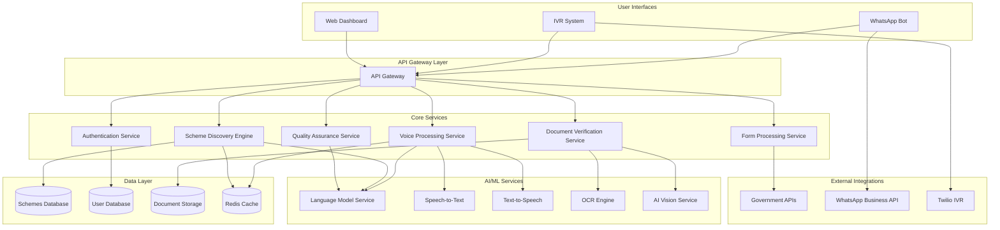

# Design Document: Yojana-Setu

## Overview

Yojana-Setu is a voice-first AI caseworker system designed to democratize access to government schemes for 800 million rural Indians. The system addresses three critical problems: lack of scheme awareness (70% of eligible citizens), middleman exploitation (Rs.500-2000 fees), and high rejection rates (40%) through an intelligent, multi-channel platform.

The architecture follows a microservices approach with dual deployment strategies: a premium AWS stack for enterprise deployment and a cost-effective open-source stack for MVP and scale phases. The system integrates advanced AI capabilities including multilingual voice processing, intelligent document verification, and proactive scheme matching.

## Architecture

### High-Level Architecture



### Deployment Architecture Options

#### Premium AWS Stack
- **Compute**: AWS Lambda for serverless functions, ECS for containerized services
- **AI/ML**: Amazon Bedrock (Claude 3.5), Amazon Transcribe, Amazon Polly, Amazon Textract
- **Storage**: DynamoDB for user data, S3 for documents, ElastiCache for caching
- **Integration**: API Gateway, SQS for messaging, EventBridge for events
- **Monitoring**: CloudWatch, X-Ray for distributed tracing

#### Cost-Effective Stack
- **Compute**: Railway/Vercel Functions, Docker containers
- **AI/ML**: Ollama + Llama 3, Whisper (fine-tuned for Hindi), gTTS, TesseractOCR
- **Storage**: Supabase/Firebase for databases, Cloudinary for document storage
- **Integration**: FastAPI/Express.js, Redis for caching
- **Monitoring**: Open-source monitoring stack (Prometheus, Grafana)

## Components and Interfaces

### 1. Multi-Channel Interface Layer

#### WhatsApp Bot Service
```typescript
interface WhatsAppBotService {
  processMessage(message: WhatsAppMessage): Promise<WhatsAppResponse>
  handleVoiceMessage(audioFile: Buffer): Promise<string>
  handleDocumentUpload(document: Buffer, type: DocumentType): Promise<DocumentProcessingResult>
  maintainConversationState(userId: string, context: ConversationContext): void
}

interface WhatsAppMessage {
  from: string
  type: 'text' | 'voice' | 'document' | 'image'
  content: string | Buffer
  timestamp: Date
}
```

#### IVR System Service
```typescript
interface IVRService {
  handleIncomingCall(callId: string, phoneNumber: string): Promise<IVRResponse>
  processVoiceInput(audioStream: Buffer, language: string): Promise<string>
  generateVoiceResponse(text: string, language: string): Promise<Buffer>
  manageCallFlow(callId: string, currentStep: string, userInput: string): Promise<IVRFlow>
}

interface IVRFlow {
  nextStep: string
  prompt: string
  expectedInputType: 'speech' | 'dtmf'
  timeout: number
}
```

#### Web Dashboard Service
```typescript
interface WebDashboardService {
  authenticateUser(credentials: UserCredentials): Promise<AuthToken>
  getApplications(userId: string, filters: ApplicationFilters): Promise<Application[]>
  assistCitizen(assistantId: string, citizenId: string): Promise<AssistedSession>
  generateReports(criteria: ReportCriteria): Promise<Report>
}
```

### 2. Core Processing Services

#### Voice Processing Service
```typescript
interface VoiceProcessingService {
  transcribeAudio(audio: Buffer, language: string): Promise<TranscriptionResult>
  synthesizeSpeech(text: string, language: string, voice: VoiceType): Promise<Buffer>
  detectLanguage(audio: Buffer): Promise<LanguageDetection>
  handleCodeMixedSpeech(audio: Buffer): Promise<TranscriptionResult>
}

interface TranscriptionResult {
  text: string
  confidence: number
  language: string
  detectedLanguages: string[]
  timestamp: Date
}
```

#### Scheme Discovery Engine
```typescript
interface SchemeDiscoveryEngine {
  findEligibleSchemes(userProfile: UserProfile): Promise<SchemeMatch[]>
  rankSchemes(schemes: Scheme[], userProfile: UserProfile): Promise<RankedScheme[]>
  updateSchemeDatabase(schemes: Scheme[]): Promise<void>
  getSchemeDetails(schemeId: string): Promise<SchemeDetails>
}

interface SchemeMatch {
  scheme: Scheme
  eligibilityScore: number
  estimatedBenefit: number
  requiredDocuments: DocumentType[]
  applicationComplexity: 'low' | 'medium' | 'high'
}

interface UserProfile {
  demographics: Demographics
  location: Location
  income: IncomeDetails
  category: SocialCategory
  familyComposition: FamilyDetails
}
```

#### Document Verification Service
```typescript
interface DocumentVerificationService {
  extractText(document: Buffer, documentType: DocumentType): Promise<OCRResult>
  verifyAuthenticity(document: Buffer, documentType: DocumentType): Promise<VerificationResult>
  validateInformation(extractedData: ExtractedData, userProfile: UserProfile): Promise<ValidationResult>
  generateQualityReport(document: Buffer): Promise<QualityReport>
}

interface OCRResult {
  extractedText: string
  structuredData: Record<string, any>
  confidence: number
  detectedFields: DocumentField[]
}

interface VerificationResult {
  isAuthentic: boolean
  confidence: number
  anomalies: string[]
  verificationMethod: string
}
```

#### Quality Assurance Service
```typescript
interface QualityAssuranceService {
  validateApplication(application: Application): Promise<QualityCheckResult>
  checkEligibility(userProfile: UserProfile, scheme: Scheme): Promise<EligibilityResult>
  verifyDocumentConsistency(documents: Document[], application: Application): Promise<ConsistencyResult>
  generateSubmissionReport(application: Application): Promise<SubmissionReport>
}

interface QualityCheckResult {
  isValid: boolean
  errors: ValidationError[]
  warnings: ValidationWarning[]
  completionScore: number
  recommendedActions: string[]
}
```

### 3. AI/ML Service Layer

#### Language Model Service
```typescript
interface LanguageModelService {
  generateResponse(prompt: string, context: ConversationContext): Promise<LLMResponse>
  extractInformation(text: string, schema: ExtractionSchema): Promise<ExtractedInformation>
  translateText(text: string, fromLanguage: string, toLanguage: string): Promise<string>
  summarizeDocument(document: string): Promise<Summary>
}

interface LLMResponse {
  text: string
  confidence: number
  reasoning: string
  suggestedActions: string[]
}
```

## Data Models

### Core Entities

#### User Profile
```typescript
interface UserProfile {
  id: string
  phoneNumber: string
  preferredLanguage: string
  demographics: {
    age: number
    gender: 'male' | 'female' | 'other'
    maritalStatus: string
    education: string
  }
  location: {
    state: string
    district: string
    block: string
    village: string
    pincode: string
  }
  socioeconomic: {
    category: 'general' | 'obc' | 'sc' | 'st'
    income: number
    occupation: string
    landHolding: number
  }
  familyDetails: {
    familySize: number
    dependents: number
    disabledMembers: number
  }
  createdAt: Date
  updatedAt: Date
}
```

#### Government Scheme
```typescript
interface Scheme {
  id: string
  name: string
  nameHindi: string
  nameRegional: Record<string, string>
  description: string
  department: string
  level: 'central' | 'state' | 'district'
  category: string
  eligibilityCriteria: EligibilityCriteria
  benefits: Benefit[]
  requiredDocuments: DocumentRequirement[]
  applicationProcess: ApplicationStep[]
  deadlines: SchemeDeadline[]
  isActive: boolean
  lastUpdated: Date
}

interface EligibilityCriteria {
  ageRange: { min: number; max: number }
  incomeLimit: number
  category: string[]
  gender: string[]
  location: LocationCriteria
  customCriteria: Record<string, any>
}
```

#### Application
```typescript
interface Application {
  id: string
  userId: string
  schemeId: string
  status: 'draft' | 'submitted' | 'under_review' | 'approved' | 'rejected'
  formData: Record<string, any>
  documents: ApplicationDocument[]
  qualityChecks: QualityCheckResult[]
  submissionHistory: SubmissionAttempt[]
  createdAt: Date
  updatedAt: Date
  submittedAt?: Date
}

interface ApplicationDocument {
  id: string
  type: DocumentType
  originalFile: string
  processedData: OCRResult
  verificationResult: VerificationResult
  uploadedAt: Date
}
```

#### Conversation Session
```typescript
interface ConversationSession {
  id: string
  userId: string
  channel: 'whatsapp' | 'ivr' | 'web'
  language: string
  context: ConversationContext
  messages: ConversationMessage[]
  currentIntent: string
  activeApplication?: string
  createdAt: Date
  lastActivity: Date
}

interface ConversationContext {
  currentStep: string
  collectedData: Record<string, any>
  pendingActions: string[]
  userPreferences: UserPreferences
}
```

## Correctness Properties

*A property is a characteristic or behavior that should hold true across all valid executions of a system—essentially, a formal statement about what the system should do. Properties serve as the bridge between human-readable specifications and machine-verifiable correctness guarantees.*

Now I need to analyze the acceptance criteria to determine which ones can be converted into testable properties.

### Converting EARS to Properties

Based on the prework analysis, I'll convert the testable acceptance criteria into universally quantified properties, consolidating redundant ones:

**Property 1: Multi-Channel Responsiveness**
*For any* user interaction through WhatsApp, IVR, or web dashboard, the system should provide appropriate interface capabilities and respond with relevant functionality
**Validates: Requirements 1.1, 6.1, 7.2**

**Property 2: Intelligent Routing**
*For any* user device capability (smartphone vs feature phone), the system should automatically route to the most appropriate channel (WhatsApp for smartphones, IVR for feature phones)
**Validates: Requirements 1.4, 1.5**

**Property 3: Comprehensive Scheme Analysis**
*For any* user demographic profile, the scheme discovery engine should analyze eligibility across all available government schemes and rank them by relevance and benefit amount
**Validates: Requirements 2.1, 2.2, 2.3**

**Property 4: Scheme Database Consistency**
*For any* change in eligibility criteria, the scheme discovery engine should update matching algorithms to reflect the changes consistently
**Validates: Requirements 2.5**

**Property 5: Multi-Language Voice Processing**
*For any* voice input in Hindi, regional languages, or code-mixed speech, the voice interface should accurately transcribe and respond in the appropriate language
**Validates: Requirements 3.1, 3.2, 3.3**

**Property 6: Conversation Context Preservation**
*For any* multi-turn conversation across voice interactions or messaging sessions, the system should maintain conversation context and state
**Validates: Requirements 3.4, 6.4**

**Property 7: Voice Error Handling**
*For any* failed voice recognition attempt, the system should request clarification in the user's detected language
**Validates: Requirements 3.5**

**Property 8: Document Processing Pipeline**
*For any* uploaded document image, the system should extract text using OCR, populate relevant form fields automatically, and trigger appropriate processing workflows
**Validates: Requirements 4.1, 4.2, 6.3**

**Property 9: Document Authenticity Verification**
*For any* document verification request, the system should validate authenticity using AI vision and provide confidence scores
**Validates: Requirements 4.3**

**Property 10: Document Type Support**
*For any* supported document type (Aadhaar, ration card, income certificate, caste certificate), the system should process it correctly
**Validates: Requirements 4.4**

**Property 11: Document Quality Feedback**
*For any* insufficient quality document, the system should provide specific guidance for resubmission
**Validates: Requirements 4.5**

**Property 12: Comprehensive Quality Validation**
*For any* completed application, the quality checker should validate all required fields, ensure document-data consistency, and confirm eligibility requirements are met
**Validates: Requirements 5.1, 5.2, 5.3**

**Property 13: Quality Error Messaging**
*For any* quality check that identifies issues, the system should provide specific error messages and correction guidance
**Validates: Requirements 5.4**

**Property 14: Submission Readiness**
*For any* application that passes quality checks, the system should generate a submission-ready application with confidence score
**Validates: Requirements 5.5**

**Property 15: Voice Message Processing**
*For any* voice message sent through WhatsApp, the system should transcribe and process the voice input appropriately
**Validates: Requirements 6.2**

**Property 16: Escalation Logic**
*For any* complex case that exceeds automated handling capabilities, the system should offer escalation to human assistance
**Validates: Requirements 6.5**

**Property 17: IVR Form Guidance**
*For any* form filling requirement through IVR, the system should guide users through step-by-step voice prompts
**Validates: Requirements 7.3**

**Property 18: Callback Functionality**
*For any* incomplete IVR session, the system should support callback functionality to resume the session
**Validates: Requirements 7.4**

**Property 19: Alternative Submission Methods**
*For any* document submission requirement through IVR, the system should provide alternative submission methods
**Validates: Requirements 7.5**

**Property 20: Dashboard Capability Access**
*For any* assisted citizen interaction through the web dashboard, all system capabilities should be accessible
**Validates: Requirements 8.2**

**Property 21: Quality Information Display**
*For any* application review through the web dashboard, quality check results and recommendations should be displayed
**Validates: Requirements 8.3**

**Property 22: Audit Trail Maintenance**
*For any* assisted interaction through the web dashboard, an audit trail should be maintained
**Validates: Requirements 8.4**

**Property 23: Batch Processing Support**
*For any* bulk operation request through the web dashboard, the system should support batch processing capabilities
**Validates: Requirements 8.5**

**Property 24: Performance Requirements**
*For any* voice processing, OCR processing, or scheme discovery operation, the system should complete within specified time limits (3s, 5s, 2s respectively)
**Validates: Requirements 10.1, 10.2, 10.3**

**Property 25: Data Encryption**
*For any* document upload, the system should encrypt all data in transit and at rest
**Validates: Requirements 11.1**

**Property 26: Data Purging**
*For any* user session that ends, the system should automatically purge temporary data after 24 hours
**Validates: Requirements 11.3**

**Property 27: Role-Based Access Control**
*For any* system component access attempt, the system should implement role-based access control restrictions
**Validates: Requirements 11.4**

**Property 28: Breach Notification**
*For any* detected data breach, the system should immediately notify administrators and affected users
**Validates: Requirements 11.5**

**Property 29: Government Portal Integration**
*For any* ready application submission, the system should integrate with relevant government portals successfully
**Validates: Requirements 12.1**

**Property 30: Submission Tracking**
*For any* completed submission, the system should provide tracking numbers and status updates
**Validates: Requirements 12.2**

**Property 31: API Compatibility**
*For any* interaction with major government scheme portals, the system should maintain API compatibility
**Validates: Requirements 12.3**

**Property 32: Bulk Government Submissions**
*For any* bulk submission requirement, the system should support batch processing to government systems
**Validates: Requirements 12.5**

## Error Handling

### Error Categories and Strategies

#### 1. Voice Processing Errors
- **Speech Recognition Failures**: Implement fallback to text input, request clarification in user's language
- **Language Detection Errors**: Default to Hindi, provide language selection options
- **Audio Quality Issues**: Request re-recording with quality guidelines

#### 2. Document Processing Errors
- **OCR Failures**: Provide manual data entry option, suggest document quality improvements
- **Document Verification Failures**: Request alternative documents, provide verification guidelines
- **Unsupported Document Types**: Provide list of supported documents, suggest alternatives

#### 3. Integration Errors
- **Government API Failures**: Implement retry logic with exponential backoff, provide offline submission options
- **WhatsApp API Limits**: Implement rate limiting, queue messages for later delivery
- **Network Connectivity Issues**: Provide offline mode capabilities, sync when connection restored

#### 4. Data Validation Errors
- **Incomplete Applications**: Provide specific field-level error messages, guide completion
- **Eligibility Mismatches**: Explain eligibility criteria, suggest alternative schemes
- **Document Inconsistencies**: Highlight specific mismatches, provide correction guidance

#### 5. System Performance Errors
- **Timeout Errors**: Implement graceful degradation, provide status updates
- **Resource Exhaustion**: Auto-scale infrastructure, implement request queuing
- **Service Unavailability**: Provide service status updates, estimated recovery times

### Error Recovery Mechanisms

#### Graceful Degradation
- Voice interface falls back to text when speech recognition fails
- Premium AI services fall back to open-source alternatives during outages
- Complex document verification falls back to manual review

#### State Recovery
- Conversation state persisted across service interruptions
- Application progress saved at each step
- Document uploads cached for retry on failure

#### User Communication
- Clear error messages in user's preferred language
- Specific guidance for error resolution
- Alternative pathways when primary methods fail

## Testing Strategy

### Dual Testing Approach

The testing strategy employs both unit testing and property-based testing to ensure comprehensive coverage:

**Unit Tests**: Verify specific examples, edge cases, and error conditions
- Integration points between services
- Specific document types and formats
- Error handling scenarios
- API endpoint responses

**Property Tests**: Verify universal properties across all inputs
- Voice processing across different languages and accents
- Document processing across various image qualities
- Scheme matching across diverse user profiles
- Quality validation across different application types

### Property-Based Testing Configuration

**Testing Framework**: fast-check for TypeScript/JavaScript components, Hypothesis for Python services

**Test Configuration**:
- Minimum 100 iterations per property test
- Each property test references its design document property
- Tag format: **Feature: yojana-setu, Property {number}: {property_text}**

**Generator Strategies**:
- **User Profile Generator**: Creates diverse demographic profiles covering all Indian states, income levels, and social categories
- **Document Image Generator**: Generates various document types with different quality levels, orientations, and lighting conditions
- **Voice Input Generator**: Creates audio samples in multiple Indian languages with various accents and background noise levels
- **Scheme Database Generator**: Creates government schemes with diverse eligibility criteria and benefit structures

### Testing Priorities

#### High Priority (Core Functionality)
1. Multi-language voice processing accuracy
2. Document OCR and verification reliability
3. Scheme discovery and matching precision
4. Quality assurance validation completeness
5. Government portal integration stability

#### Medium Priority (User Experience)
1. Conversation context preservation
2. Error message clarity and language appropriateness
3. Performance requirements compliance
4. Multi-channel interface consistency

#### Low Priority (Edge Cases)
1. Unusual document formats and orientations
2. Extreme network conditions
3. Concurrent user load scenarios
4. Data migration and backup procedures

### Test Data Management

**Synthetic Data Generation**:
- AI-generated user profiles representing diverse Indian demographics
- Synthetic document images for training and testing
- Simulated government scheme databases
- Mock government API responses

**Privacy-Compliant Testing**:
- No real user data in test environments
- Anonymized patterns from production for realistic testing
- Compliance with Indian data protection regulations

**Test Environment Isolation**:
- Separate test instances of all external services
- Mock government APIs for integration testing
- Isolated document storage for test data

This comprehensive testing strategy ensures that Yojana-Setu meets its correctness properties while maintaining high reliability and user experience standards across all supported channels and use cases.