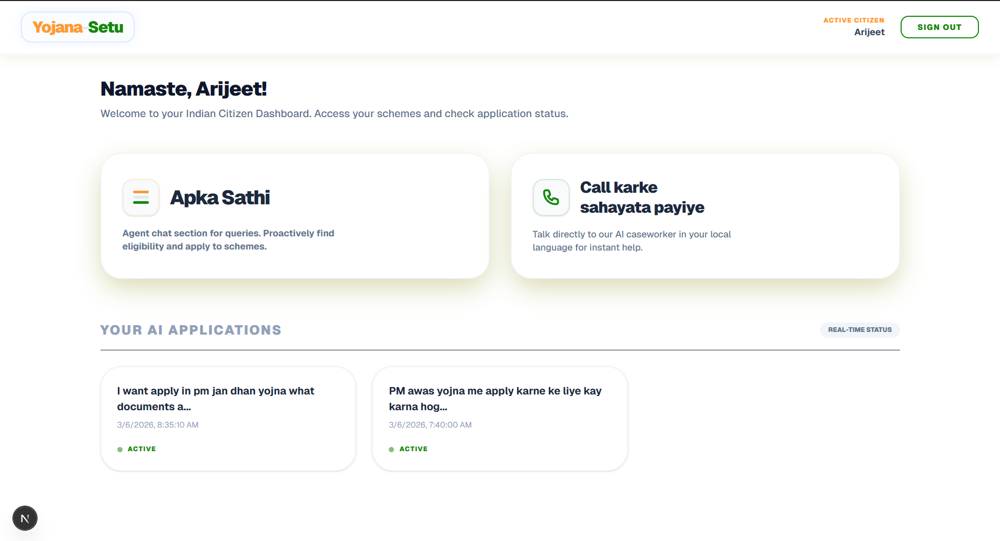
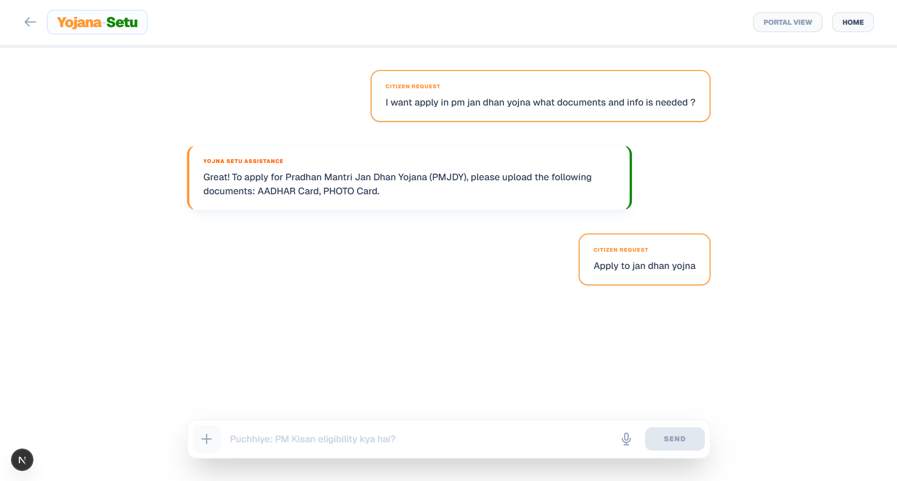
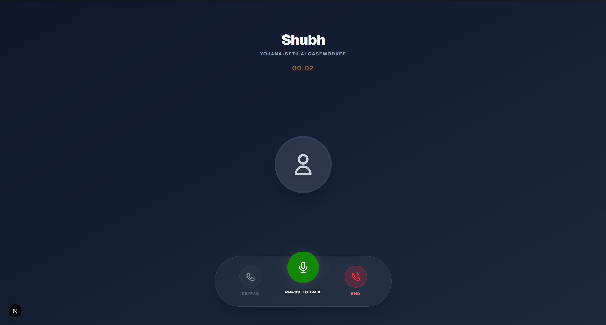

# 🇮🇳 Yojana-Setu: Phygital AI Caseworker

Yojana-Setu is a state-of-the-art **Phygital (Physical + Digital)** AI platform designed to bridge the gap between complex government schemes and rural Indian citizens. Leveraging advanced LLMs, Voice-to-Voice agents, and automated robotic process automation (RPA), it simplifies scheme discovery and application filing.

---

##  Project Views
| Desktop Interface | Mobile/Tablet View | Multi-Step Automation |
| :---: | :---: | :---: |
|  |  |  |

---

##  Quick Start Manual

### 1. Prerequisites
- **Python 3.10+** & **Node.js 18+**
- AWS Account (DynamoDB & S3)
- API Keys: Sarvam AI, Pinecone, Groq

### 2. Backend Setup
```bash
cd backend
python -m venv .venv
source .venv/bin/activate  # Windows: .venv\Scripts\activate
pip install -r ../requirements.txt
```
- Configure your `.env` file in the root directory.
- Run the setup script to initialize cloud tables: `python setup_dynamodb.py`
- Start the server: `uvicorn main:app --reload`

### 3. Frontend Setup
```bash
cd frontend
npm install
npm run dev
```
Open [http://localhost:3000](http://localhost:3000) to view the application.

---

##  Live Application
> [!NOTE]
> **Live Link:** [Coming Soon]

---

##  Technical Architecture

### Core Stack
- **Frontend**: Next.js 14, Tailwind CSS, Framer Motion (Glassmorphism UI).
- **Backend**: FastAPI (Python), Uvicorn.
- **AI/LLMs**: 
  - **Sarvam AI**: For `sarvam-30b` reasoning and high-fidelity Indic TTS/STT.
  - **Llama 3.3 (Groq)**: For real-time voice agent orchestration.
- **RAG Engine**: Pinecone Vector DB with `SentenceTransformer` (bi-encoder) and `Cross-Encoder` reranking.
- **Database**: AWS DynamoDB (User Profiles & Chat Sessions).
- **Validation**: Sarvam Document Intelligence for OCR-based ID verification.

---

##  Current Implementation Features
- **Multilingual Voice-to-Voice Agent**: Real-time support in Hindi, English, and other regional languages.
- **Automated Scheme Filing**: RPA-driven submission to portals like PMAY and PMJDY.
- **Document Intelligence**: Auto-extraction of Aadhaar, PAN, and Income details from uploads.
- **Premium Aesthetics**: white-themed "Make in India" preloader and ornate UI components.

---

##  Future Roadmap: Scaling & Implementation

### 1. Enhanced Scheme Support
- **PMAY-G & PMAY-U**: Advanced eligibility checking using geo-tagging and income verification APIs.
- **Jan Dhan Yojana (PMJDY)**: Direct integration with e-KYC modules for instant account opening.
- **One-Click Scaling**: Framework designed to add new schemes by simply updating the `SCHEME_REGISTRY` mapping.

### 2. Pros & Automation Benefits
- **Zero Jargon**: AI converts complex legal policy text into simple, spoken local dialects.
- **Automation Efficiency**: Reduces manual form-filling time from 30 minutes to <2 minutes.
- **Self-Correction**: AI-driven validation catches errors in IDs *before* they hit the government portal, reducing rejection rates.

### 3. Advanced Multilingual Support
- Expansion to all 22 scheduled languages of India using Sarvam's unified Indic model.
- Dialect-specific speech recognition (e.g., Bhojpuri-inflected Hindi).

---

##  Make In India
Yojana-Setu is built with the vision of **Digital Inclusion for All**, ensuring that the benefits of digital India reach the last person in the queue.

---
© 2026 Team AI for Bharat
